<p align="center">
  
</p>

<h1 align="center">MPP Viewer</h1>

<p align="center">
  <strong>A free, native macOS app for reviewing, creating, and updating project plans</strong><br>
  No Windows. No MS Project license. No subscriptions.<br>
  Open `.mpp` files &bull; Create native `.mppplan` files &bull; Built with SwiftUI &bull; Powered by MPXJ
</p>

<p align="center">
  <a href="https://github.com/Engagendy/MPPViewerMacOS/releases"></a>
  
  
  
  
</p>

---

## Why MPP Viewer

- Review Microsoft Project schedules on macOS without opening Windows or buying Microsoft Project.
- Build native plans directly in the app with grid editing, Gantt editing, resources, calendars, statusing, and finance.
- Run analysis, workload, validation, and earned value from the same project model instead of jumping between tools.
- Import operational spreadsheets, update status centrally, and export governance-ready outputs from the same workspace.

## What You Can Do

- Open `.mpp` files for review, diagnostics, reporting, and schedule analysis.
- Create `.mppplan` files for fully native planning and ongoing project control.
- Edit tasks in a grid, in Gantt, or through focused status and resource workflows.
- Track baselines, actuals, costs, overtime, CPI/SPI/EAC/VAC, and workload in one app.
- Import tasks, resources, calendars, assignments, dependencies, constraints, and baselines from mapped spreadsheets.

## Quick Start

1. Download the latest release from [GitHub Releases](https://github.com/Engagendy/MPPViewerMacOS/releases) or install with Homebrew.
2. Open the included [aurora-commerce-launch.mppplan](docs/sample-plans/aurora-commerce-launch.mppplan) to explore a fully populated native project.
3. Start in `Plan Builder` to edit, `Dashboard` to review, or `Status Center` / `Earned Value` for controls work.

## Document Modes

| Document Type | Best For | Editing |
|---|---|---|
| `.mpp` | Reviewing Microsoft Project schedules on macOS | Read-only review and analysis |
| `.mppplan` | Building and updating plans directly in the app | Full native editing |

## Screenshots

All screenshots below were captured from the included showcase native plan:
[aurora-commerce-launch.mppplan](docs/sample-plans/aurora-commerce-launch.mppplan)

### Core Review Views

<p align="center">
  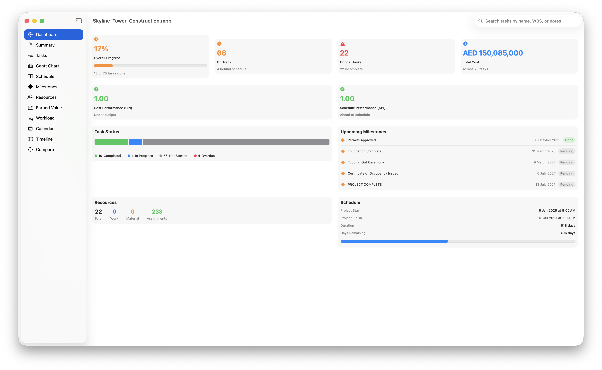
  <br><em>Dashboard — project health overview with KPIs, milestones, and schedule status</em>
</p>

<p align="center">
  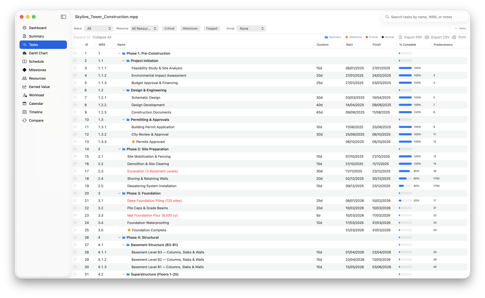
  <br><em>Task Table — hierarchical WBS with duration, dates, progress bars, and predecessors</em>
</p>

<p align="center">
  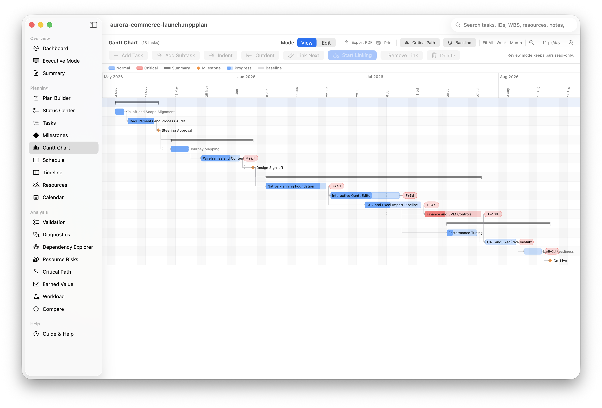
  <br><em>Gantt Chart — zoomable timeline with critical path, baselines, milestones, and dependency arrows</em>
</p>

<p align="center">
  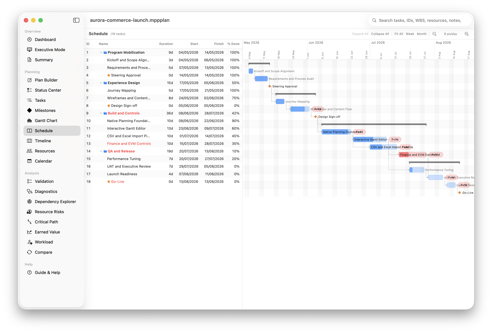
  <br><em>Schedule View — MS Project-style split view with task list and Gantt side by side</em>
</p>

<p align="center">
  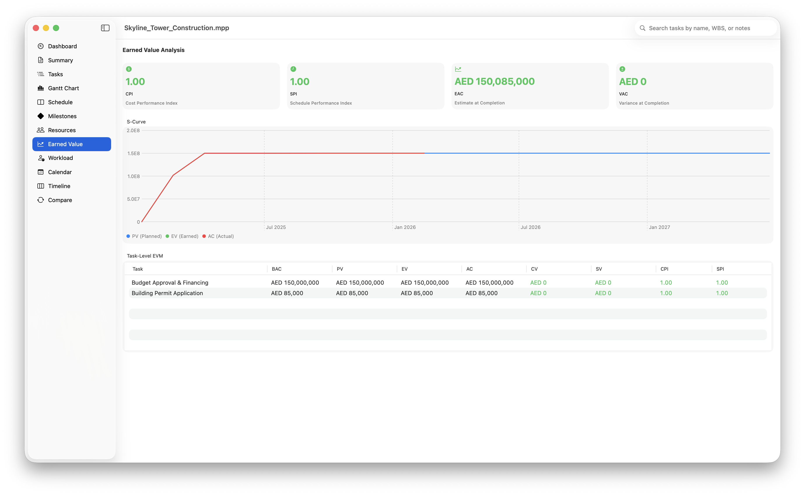
  <br><em>Earned Value Analysis — CPI, SPI, EAC, VAC with S-Curve chart and task-level EVM table</em>
</p>

<p align="center">
  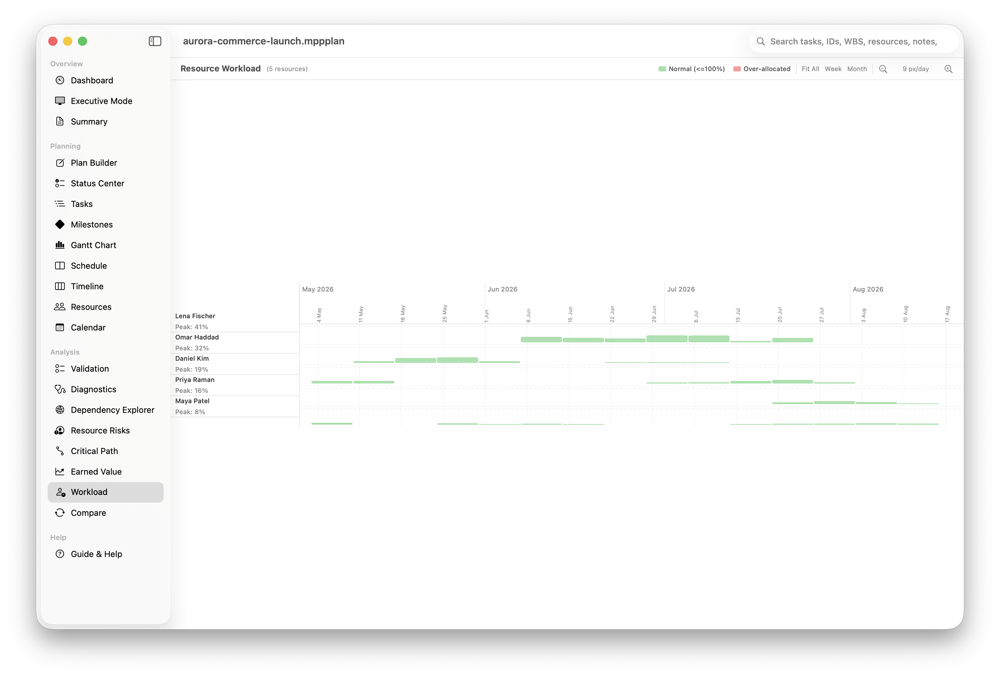
  <br><em>Resource Workload — weekly allocation view with over-allocation highlighting</em>
</p>

### Native Planning Workflow

<p align="center">
  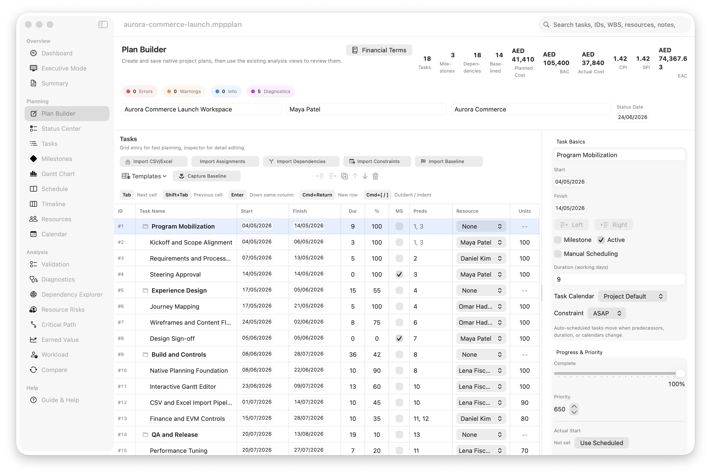
  <br><em>Plan Builder — grid-first planning with task hierarchy, assignments, finance, constraints, and baselines</em>
</p>

<p align="center">
  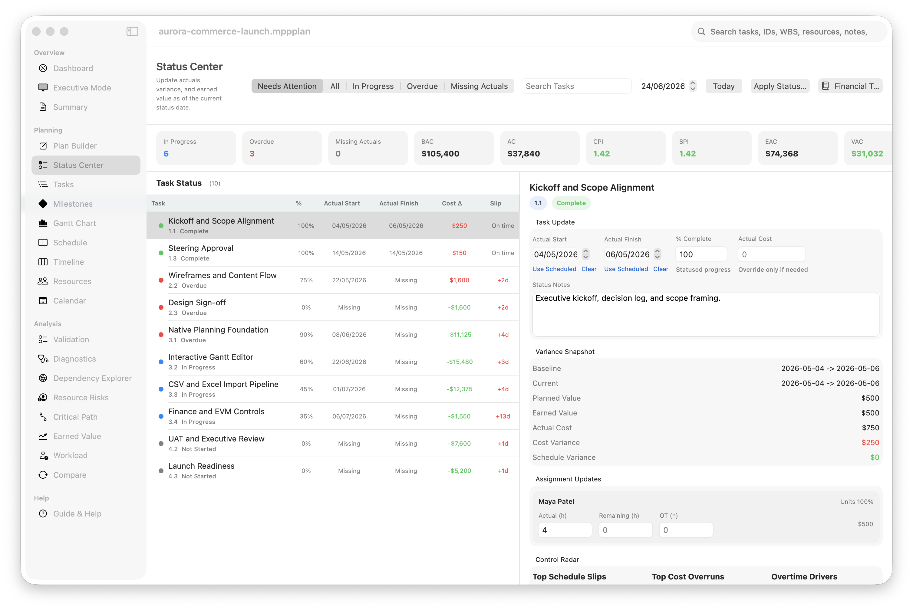
  <br><em>Status Center — status-date updates, actual dates, actual costs, overtime, and live variance review</em>
</p>

<p align="center">
  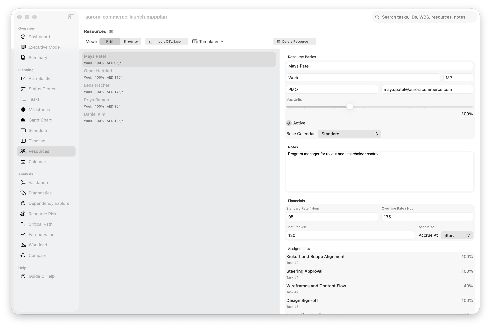
  <br><em>Resources — native staffing editor with rates, calendars, assignments, and accrual setup</em>
</p>

<p align="center">
  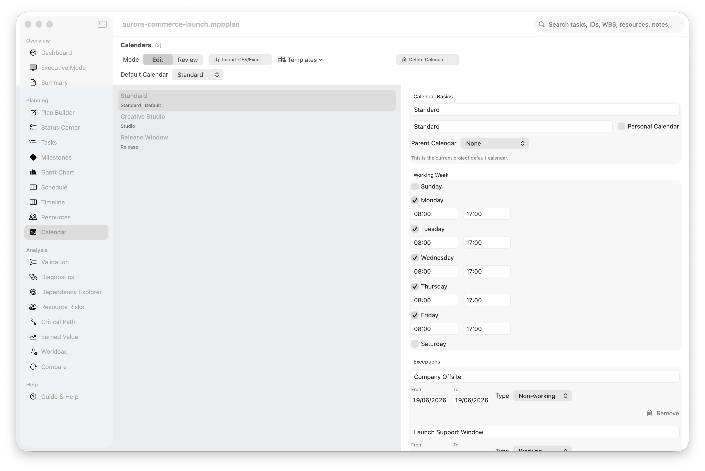
  <br><em>Calendar — working week, project default calendar, and leave/holiday exception editing</em>
</p>

<p align="center">
  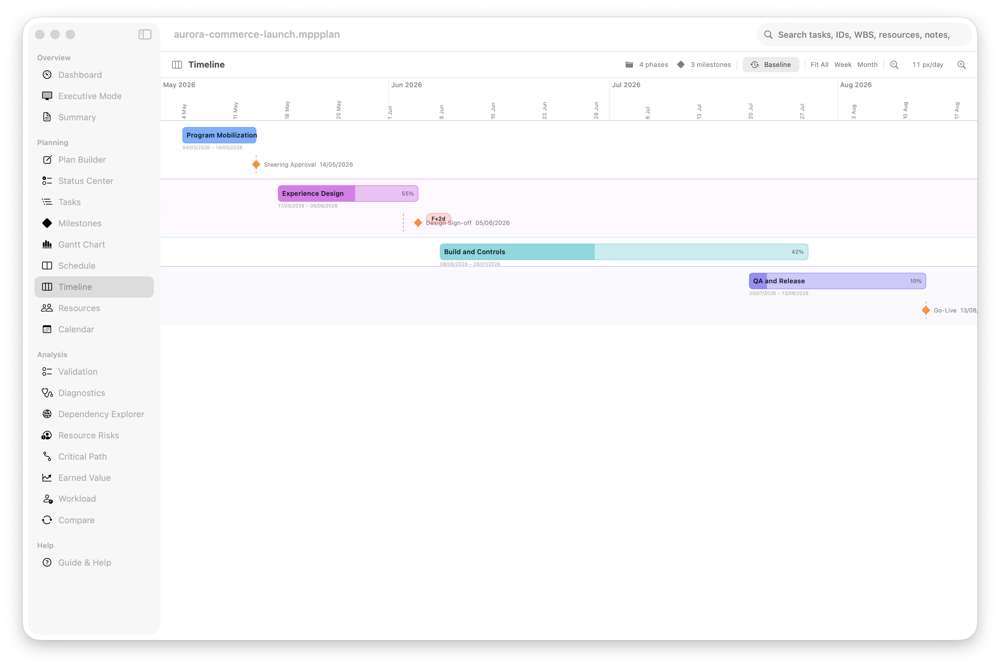
  <br><em>Timeline — high-level phase and milestone summary for steering and executive review</em>
</p>

<p align="center">
  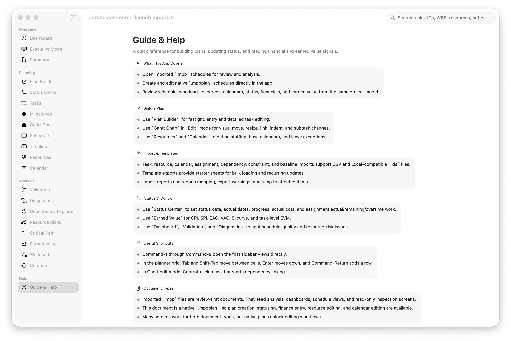
  <br><em>Guide &amp; Help — built-in onboarding, workflow guidance, glossary, document types, and shortcuts</em>
</p>

## Showcase Sample Plan

- Open [aurora-commerce-launch.mppplan](docs/sample-plans/aurora-commerce-launch.mppplan) to explore the native planning workflow with tasks, hierarchy, resources, calendars, assignments, earned value, and workload already populated.
- The sample is intended for demos, screenshots, and first-run exploration of the app’s editing and analysis features.

## Recommended Tour

1. Open the included [aurora-commerce-launch.mppplan](docs/sample-plans/aurora-commerce-launch.mppplan) to see a fully populated native plan.
2. Start in `Plan Builder` or `Gantt Chart` if you want to edit, or `Dashboard` / `Earned Value` if you want to review.
3. Open `Resources` and `Calendar` to see native staffing and working-time setup.
4. Use `Status Center` to apply actual dates, progress, cost, and overtime updates against a status date.
5. Finish in `Workload`, `Validation`, `Diagnostics`, and `Compare` for review and follow-up.

---

## Installation

### Homebrew (recommended)

```bash
brew tap Engagendy/tap
brew install --cask mpp-viewer
```

### Direct Download

1. Download the latest `.dmg` from [GitHub Releases](https://github.com/Engagendy/MPPViewerMacOS/releases)
2. Open the DMG and drag **MPP Viewer** to your Applications folder
3. On first launch, right-click the app → **Open** → **Open** (required for unsigned apps)

> The app bundles its own Java runtime and converter — no prerequisites needed.

### Gatekeeper Bypass

Since the app is not signed with an Apple Developer certificate, macOS will show an "unidentified developer" warning. To bypass this:

**Option A — Right-click Open (recommended):**
Right-click (or Control-click) the app → **Open** → click **Open** in the dialog.

**Option B — Remove quarantine attribute:**
```bash
xattr -cr /Applications/MPPViewer.app
```

**Option C — System Settings:**
Go to **System Settings → Privacy & Security**, scroll down, and click **Open Anyway** next to the MPP Viewer message.

---

## Features

### File Types
- Open Microsoft Project `.mpp` files for review and analysis.
- Create, save, and reopen native editable `.mppplan` files.
- Use document-based macOS behavior so plans open directly from Finder.

### Native Planning
- `Plan Builder` for fast grid entry plus a detailed task inspector.
- Create, delete, duplicate, reorder, indent, and outdent tasks.
- Edit task dates, duration, milestones, predecessors, constraints, baselines, actual dates, and financial overrides.
- Grid-first editing designed to feel closer to Microsoft Project for rapid task entry.

### Visual Gantt Editing
- `Gantt Chart` supports both review and native-plan editing.
- Move task bars, resize duration, create and remove dependencies, and restructure task hierarchy.
- Create tasks and subtasks directly from Gantt.
- Use `View | Edit` mode so the chart stays clean in review mode.
- Includes baseline overlays, critical path styling, variance indicators, and zoom controls.

### Imports, Templates, and Bulk Loading
- Import tasks, resources, calendars, assignments, dependencies, constraints, and baselines.
- Supports CSV and Excel-compatible `.xls` templates.
- Built-in mapping sheets let you map arbitrary column names before import.
- Import reports show created/updated/skipped rows, warnings, and jump-to-item actions.
- Template exports help teams prepare spreadsheets in the right format.

### Resources, Calendars, and Staffing
- Native resource editor with name, type, initials, group, email, max units, rates, and cost-per-use.
- Native calendar editor with working days, work ranges, exceptions, default calendar selection, and leave-style exceptions.
- Quick task assignment from both the planner grid and Gantt.
- Resource workload and resource-risk views for overload detection and staffing review.

### Statusing and Project Controls
- `Status Center` for status-date-based updates.
- Update actual start, actual finish, percent complete, actual cost, status notes, and assignment actual/remaining/overtime hours.
- Control filters for in-progress, overdue, needs-attention, and missing-actuals tasks.
- Live cost and schedule indicators such as `BAC`, `AC`, `CPI`, `SPI`, `EAC`, and `VAC`.

### Finance and Earned Value
- Native plan finance authoring includes fixed cost, baseline cost, actual cost, resource rates, cost-per-use, accrual timing, and assignment overtime.
- `Earned Value` screen includes KPI cards, S-curve, and task-level EVM analysis.
- Financial metrics are available across planner, Gantt, dashboard, and status workflows.
- Abbreviations such as `BAC`, `PV`, `EV`, `AC`, `CPI`, `SPI`, `EAC`, `VAC`, and `TCPI` now have in-app glossary help.

### Analysis and Review
- `Dashboard` and `Executive Mode` for health review, KPIs, milestones, and export-ready summaries.
- `Validation` for planning and data quality issues.
- `Diagnostics` and `Dependency Explorer` for schedule-logic analysis.
- `Critical Path`, `Resource Risks`, `Workload`, `Timeline`, and `Schedule` views for focused review.
- `Compare` view for diffing another `.mpp` or native plan against the current project.

### Notes, Exports, and Reporting
- Persistent local review notes per task.
- Markdown, CSV, PDF, and Excel-compatible exports in relevant screens.
- Review pack and issue exports for recurring governance workflows.

### Help and Usability
- In-app `Guide & Help` screen with feature documentation and workflow guidance.
- macOS Help menu entries for the guide and financial glossary.
- Search across task name, ID, WBS, notes, resources, and custom fields.
- Keyboard shortcuts for navigation and planner editing.

---

## Building from Source

### Requirements

| Requirement | Version |
|-------------|---------|
| macOS | 14.0 (Sonoma) or later |
| Xcode | 15.0+ |
| Java | OpenJDK 21 |
| Maven | 3.8+ |

### Development Setup

```bash
# Clone the repository
git clone https://github.com/Engagendy/MPPViewerMacOS.git
cd MPPViewerMacOS

# Build the Java converter
cd MPPConverter && mvn clean package && cd ..

# Open in Xcode
open MPPViewer/MPPViewer.xcodeproj
```

Select the **MPPViewer** scheme, choose **My Mac** as the destination, and hit **Run** (Cmd+R).

### Building a DMG for Distribution

```bash
./scripts/package.sh
```

This script builds the JAR, builds the app, bundles the Eclipse Temurin JRE and converter JAR into the app, and creates a `.dmg` ready for distribution.

Options: `--skip-jar`, `--skip-app`, `--arch arm64|x86_64`, `--version X.Y.Z`

---

## Architecture

```
MPPViewerMacOS/
├── MPPViewer/                          # macOS app (Swift/SwiftUI)
│   ├── App/                            # Entry point, routing, document handling, help
│   ├── Models/                         # Runtime + native planning models
│   ├── Services/                       # MPP conversion, validation, EVM, workload
│   ├── Views/
│   │   ├── Dashboard/                  # Health review, executive mode, snapshots
│   │   ├── Planner/                    # Native plan builder
│   │   ├── Gantt/                      # Interactive chart + editing
│   │   ├── Schedule/                   # Schedule review layout
│   │   ├── Tasks/                      # Task table, detail inspector, dependency exploration
│   │   ├── Milestones/                 # Milestone tracking and health analysis
│   │   ├── Resources/                  # Resource review + native editor
│   │   ├── Calendar/                   # Calendar review + native editor
│   │   ├── EarnedValue/                # EVM dashboard with S-Curve
│   │   ├── Workload/                   # Resource workload heatmap
│   │   ├── Timeline/                   # Executive timeline view
│   │   ├── Diff/                       # Comparison and baseline review
│   │   ├── Summary/                    # Project metadata
│   │   └── Components/                 # Shared UI, import mapping, controls
│   └── Utilities/                      # CSV/PDF export, print, date formatting
├── MPPConverterXPC/                    # XPC service target (sandboxed builds)
├── MPPConverter/                       # Java converter (Maven project)
│   └── src/main/java/.../MppToJson.java
└── scripts/
    └── package.sh                      # Build & package script
```

### How it works

```
.mpp file → MPPConverterService (Swift)
                 ↓
         Java Process / XPC Service
                 ↓
         MPXJ (Java) → JSON
                 ↓
         JSONProjectParser (Swift)
                 ↓
         ProjectModel → SwiftUI Views
```

1. The app receives an `.mpp` file through the macOS document system
2. `MPPConverterService` invokes a Java process running the MPXJ-based converter JAR
3. MPXJ reads the binary `.mpp` format and outputs structured JSON
4. `JSONProjectParser` decodes the JSON into Swift model objects
5. SwiftUI views render the project data across all tabs

---

## Tech Stack

- **UI Framework:** SwiftUI with Canvas for Gantt and workload rendering
- **Platform APIs:** AppKit (PDF generation, printing, file dialogs)
- **Project Parsing:** [MPXJ 13.4.0](https://www.mpxj.org/) — the industry-standard library for reading Microsoft Project files
- **Build Tools:** Xcode (Swift), Maven (Java)
- **CI/CD:** GitHub Actions — automated build, release, and Homebrew cask update on tag push
- **Minimum Target:** macOS 14.0 Sonoma

---

## Contributing

Contributions are welcome. Please open an issue to discuss proposed changes before submitting a pull request.

1. Fork the repository
2. Create your feature branch (`git checkout -b feature/amazing-feature`)
3. Commit your changes (`git commit -m 'Add amazing feature'`)
4. Push to the branch (`git push origin feature/amazing-feature`)
5. Open a Pull Request

---

## License

This project is licensed under the MIT License. See [LICENSE](LICENSE) for details.

---

<p align="center">
  <sub>Built with SwiftUI for macOS &bull; Powered by <a href="https://www.mpxj.org/">MPXJ</a></sub>
</p>
